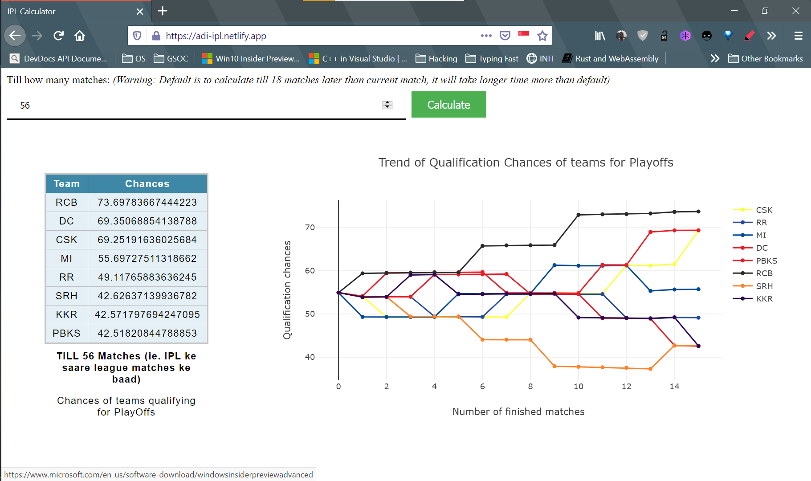

# IPL Qualification Calculator

    <a href="https://www.codefactor.io/repository/github/adi-g15/ipl_pred"></img></a>
    <a href="https://app.netlify.com/sites/ipl-calculator/deploys"></img></a>
    <a href="https://www.deepcode.ai/app/gh/adi-g15/ipl_pred/_/dashboard?utm_content=gh%2Fadi-g15%2Fipl_pred"></img></a>

 

    <a href="https://gitpod.io/#https://github.com/adi-g15/ipl_pred">
    
    </img>
    </a>

Calculates the mathematical chances of each team qualifying for playoffs in Indian Premier League (Vivo IPL bhi bol sakte hai 🙂)

The compute intensive algorithm is implemented in Rust, and interfaced to Javascript through WebAssembly.

It also gives many interesting insights into how the chances change, and affect each other, some observations can be found in data/graph_data.json. And i am planning to use it to show the graph of how the chances varies match by match.

### Tech Stack

> Note: Jaan bujh kar complex banaya gaya, taaki jyada se jyada naya try kar paye, jaha kuchh aur simple ho sakta tha, lekin main code ko hamesha simple rkhne ki koshish karta hu

Rust
Javascript
WebAssembly
AirTable
Serverless lambda functions

> If thinking simply, we can remove... Rust, WebAssembly, and Serverless 🙂

More instructions to README will be added after the graph feature is added

### Future Tasks

* Graph of deviations in chances for each team, after each match
* API endpoint to return already computed chances
* Computing default case in background, and asynchronously request for complete chances from that point on, if available return it, if not return null in data, AND start a task to compute the chances then

> 3rd one only makes sense to me if on a dedicated backend
